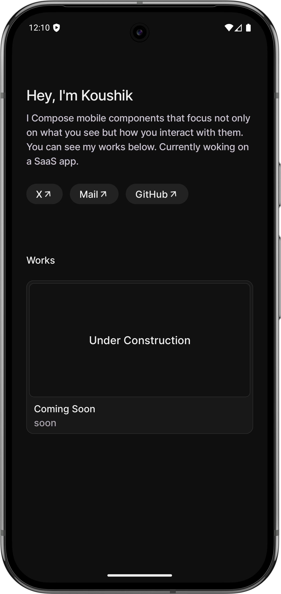
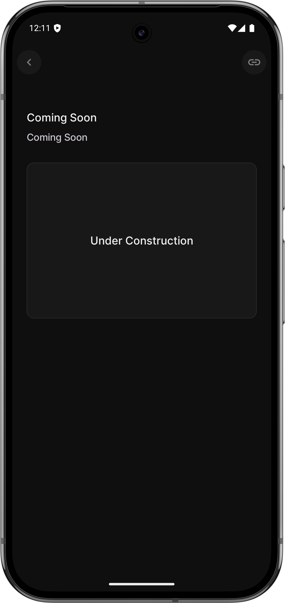
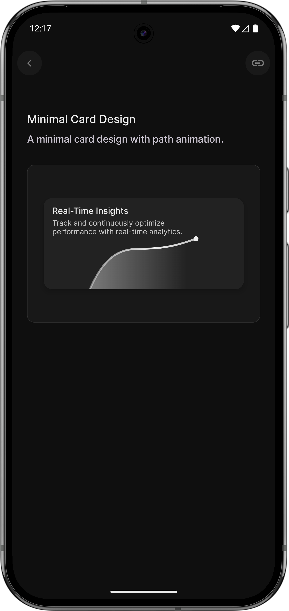
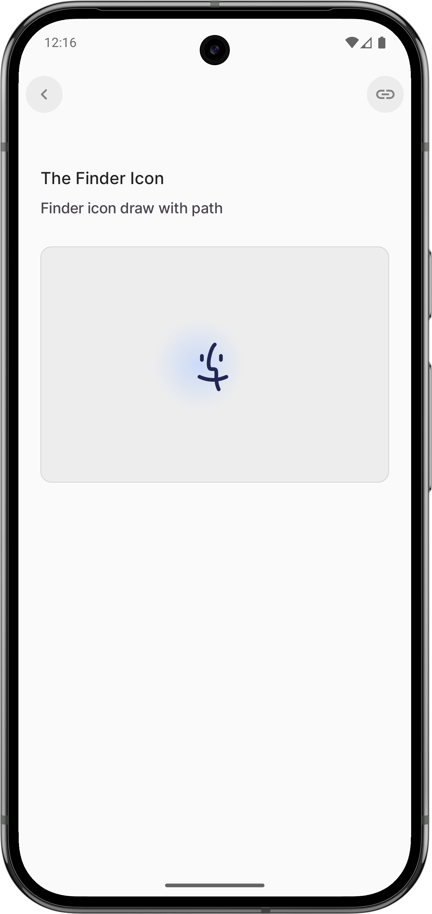
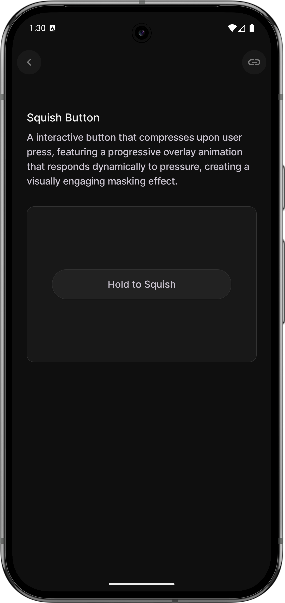

  
  <h1><b>Portfolio</b></h1>
  

    A minimal <code>Portfolio</code> Application to showcase my work as an <strong>Android Engineer</strong>.
  

 ## **Layout**

<table>
  <tr>
    <td style="padding: 10px;">
      
    </td>
    <td style="padding: 10px;">
      
    </td>
  </tr>
</table>

## **Card Path Design** 

  <table>
  <tr>
    <td style="padding: 10px;">
      
    </td>
      </tr>
</table>
    

    🔗 
      <a href="https://github.com/koushikc-125/Portfolio/blob/main/app/src/main/java/com/example/portfolio/components/CardDesign.kt">Visit</a>
  

  

## **The Finder Icon**

  <table>
  <tr>
    <td style="padding: 10px;">
    
      </td>
      </tr>
</table>
  

    🔗 
    <a href="https://github.com/koushikc-125/Portfolio/blob/main/app/src/main/java/com/example/portfolio/components/GradientWithIcon.kt">
  Visit
</a>
  

  

## **Squish button** 

  <table>
  <tr>
    <td style="padding: 10px;">
      
    </td>
      </tr>
</table>
    

    🔗 
      <a href="https://github.com/koushikc-125/Portfolio/blob/main/app/src/main/java/com/example/portfolio/components/Squish Button.kt">Visit</a>
  

  

